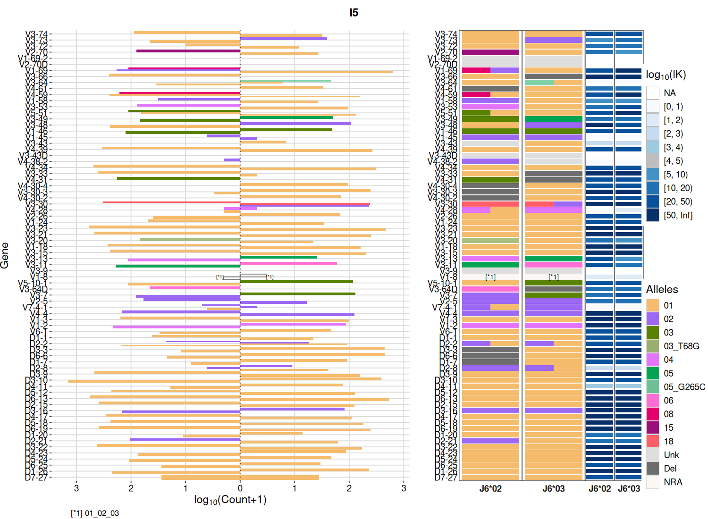
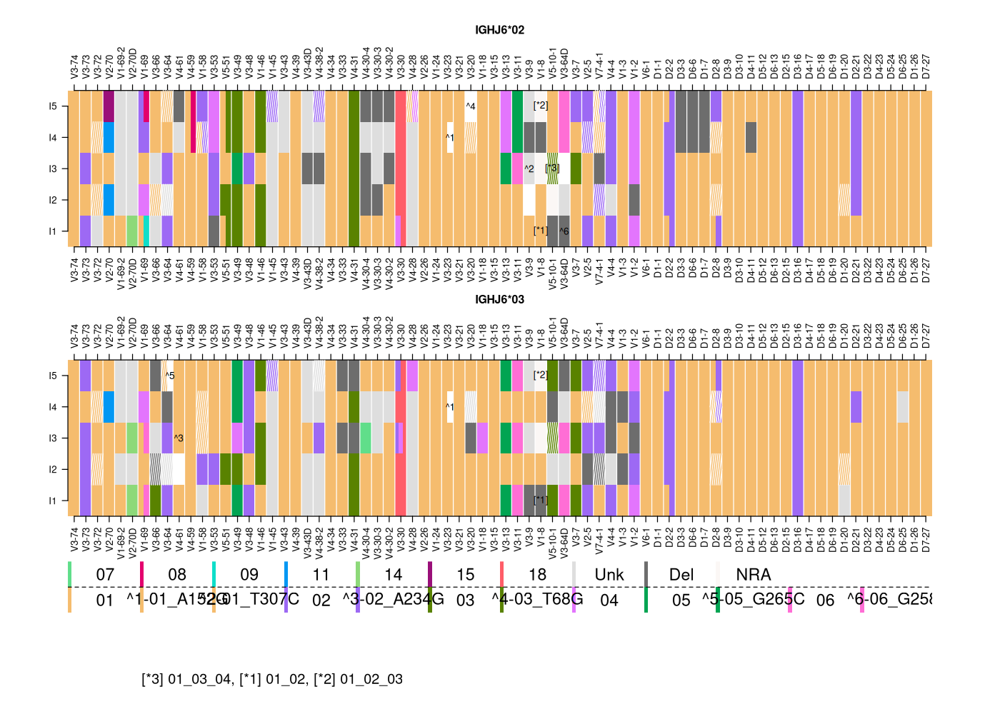
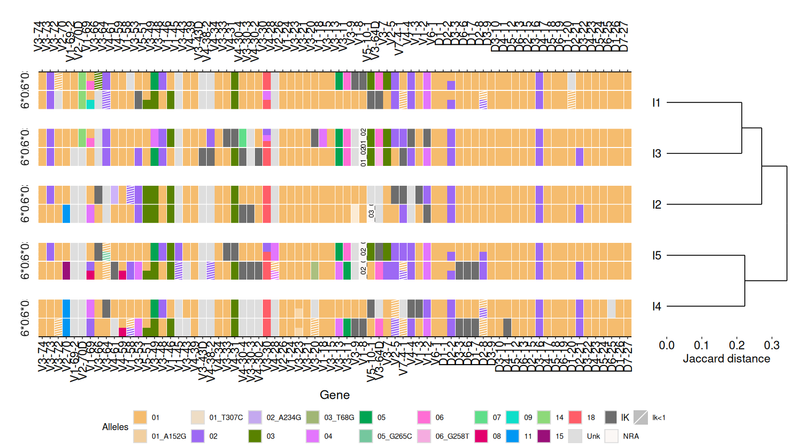
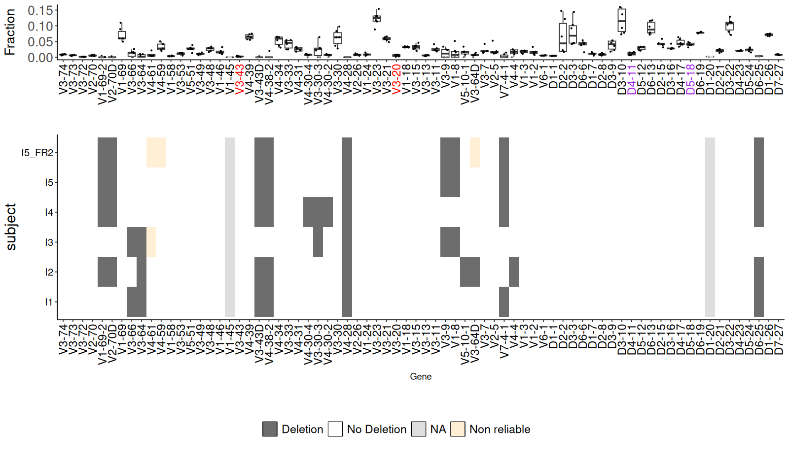
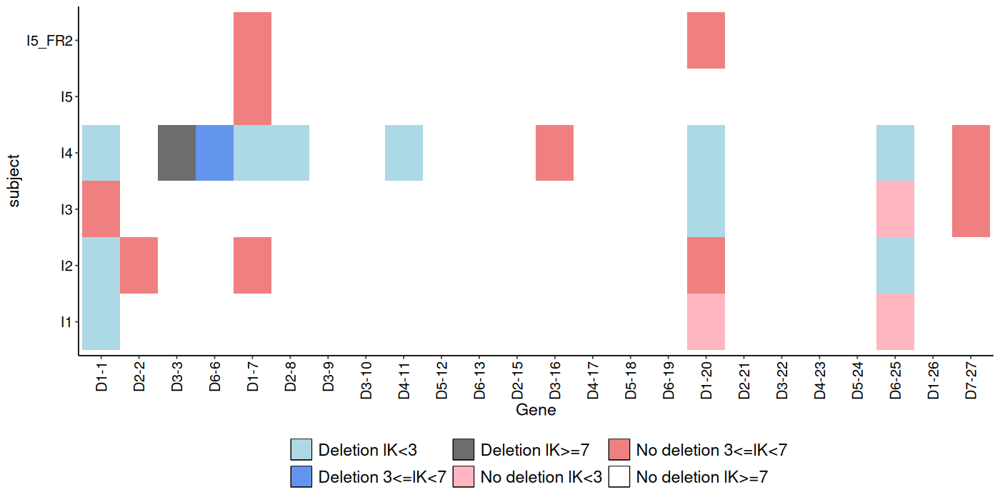
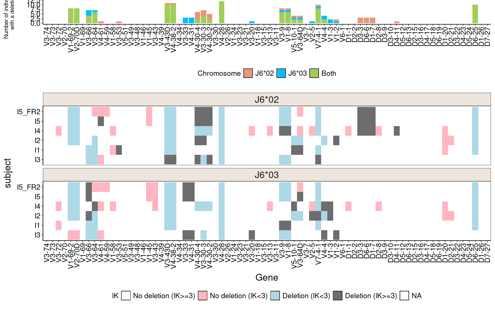

# Tutorial

This tutorial mirrors the package vignette. It uses the bundled example repertoire `samples_db`
(several individuals of IGH AIRR-seq data) and the bundled germline references.

```r
library(rabhit)
data(samples_db, HVGERM, HDGERM)
```

## Haplotype inference by an anchor gene

### J gene anchor (IGHJ6)

Roughly one third of individuals are heterozygous at `IGHJ6`, which makes it a natural anchor.

```r
clip_db <- samples_db[samples_db$subject == "I5", ]

haplo_db_J6 <- createFullHaplotype(clip_db,
                                   toHap_col = c("v_call", "d_call"),
                                   hapBy_col = "j_call", hapBy = "IGHJ6",
                                   toHap_GERM = c(HVGERM, HDGERM))
head(haplo_db_J6, 3)
```

Plot the haplotype map:

```r
plotHaplotype(haplo_db_J6)
```

{ loading=lazy }

The left panel shows per-gene read counts, the middle panels the allele frequencies on each
chromosome (one column per anchor allele), and the right panels the Bayes factor `lK` for each
assignment.

### D gene anchor (IGHD2-21)

Any sufficiently heterozygous gene can be used as the anchor:

```r
haplo_db_D2_21 <- createFullHaplotype(clip_db,
                                      toHap_col = "v_call",
                                      hapBy_col = "d_call", hapBy = "IGHD2-21",
                                      toHap_GERM = HVGERM)
```

!!! tip
    The anchor must be heterozygous with exactly two alleles, each above `min_minor_fraction`
    (default `0.3`). Samples that do not meet this are reported and skipped.

## Visualizing multiple samples

Infer haplotypes for several subjects, then draw a heatmap. `hapHeatmap` returns the plot together
with an optimal width/height for rendering:

```r
clip_dbs <- samples_db[samples_db$subject != "I5_FR2", ]
haplo_db <- createFullHaplotype(clip_dbs,
                                toHap_col = c("v_call", "d_call"),
                                hapBy_col = "j_call", hapBy = "IGHJ6",
                                toHap_GERM = c(HVGERM, HDGERM))

p.list <- hapHeatmap(haplo_db)
p.list$p          # the plot
p.list$width      # suggested width
p.list$height     # suggested height
```

{ loading=lazy }

A dendrogram clusters samples by haplotype similarity (Jaccard distance). This needs the optional
`ggdendro` package:

```r
hapDendo(haplo_db)
```

{ loading=lazy }

## Deletion inference

### Double-chromosome deletions (binomial test)

```r
del_binom_db <- deletionsByBinom(clip_dbs)
del_binom_db <- del_binom_db[grep("IGHJ", del_binom_db$gene, invert = TRUE), ]
plotDeletionsByBinom(del_binom_db)
```

{ loading=lazy }

### Single-chromosome deletions (V pooled)

```r
nonReliable_Vgenes <- nonReliableVGenes(samples_db)
del_db <- deletionsByVpooled(samples_db, nonReliable_Vgenes = nonReliable_Vgenes)
head(del_db)
plotDeletionsByVpooled(del_db)
```

{ loading=lazy }

### Deletion heatmap across subjects

```r
del_binom_db <- deletionsByBinom(samples_db, nonReliable_Vgenes = nonReliable_Vgenes)
haplo_db <- createFullHaplotype(samples_db,
                                toHap_col = c("v_call", "d_call"),
                                hapBy_col = "j_call", hapBy = "IGHJ6",
                                toHap_GERM = c(HVGERM, HDGERM),
                                deleted_genes = del_binom_db,
                                nonReliable_Vgenes = nonReliable_Vgenes)
deletionHeatmap(haplo_db)
```

{ loading=lazy }

## Handling partial V coverage

For datasets with partial V coverage (e.g. primer-limited protocols), detect non-reliable V genes and
feed them — together with detected deletions — back into the haplotype inference:

```r
clip_db <- samples_db[samples_db$subject == "I5_FR2", ]
nonReliable_Vgenes <- nonReliableVGenes(clip_db)
del_binom_db <- deletionsByBinom(clip_db, chain = "IGH",
                                 nonReliable_Vgenes = nonReliable_Vgenes)

haplo_db <- createFullHaplotype(clip_db,
                                toHap_col = c("v_call", "d_call"),
                                hapBy_col = "j_call", hapBy = "IGHJ6",
                                toHap_GERM = c(HVGERM, HDGERM),
                                deleted_genes = del_binom_db,
                                nonReliable_Vgenes = nonReliable_Vgenes)
```

## Interactive output

Set `html_output = TRUE` to obtain an interactive HTML5 plot (requires `plotly` and `htmlwidgets`):

```r
p <- plotHaplotype(hap_table = haplo_db, html_output = TRUE)
htmlwidgets::saveWidget(p, "haplotype.html", selfcontained = TRUE)
```
