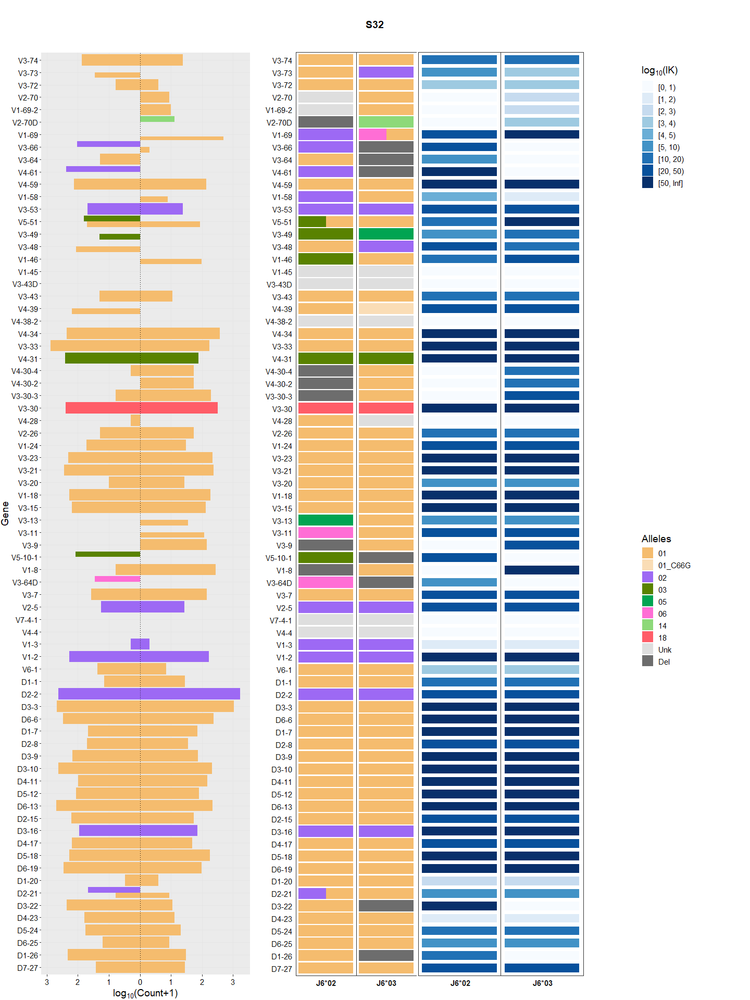
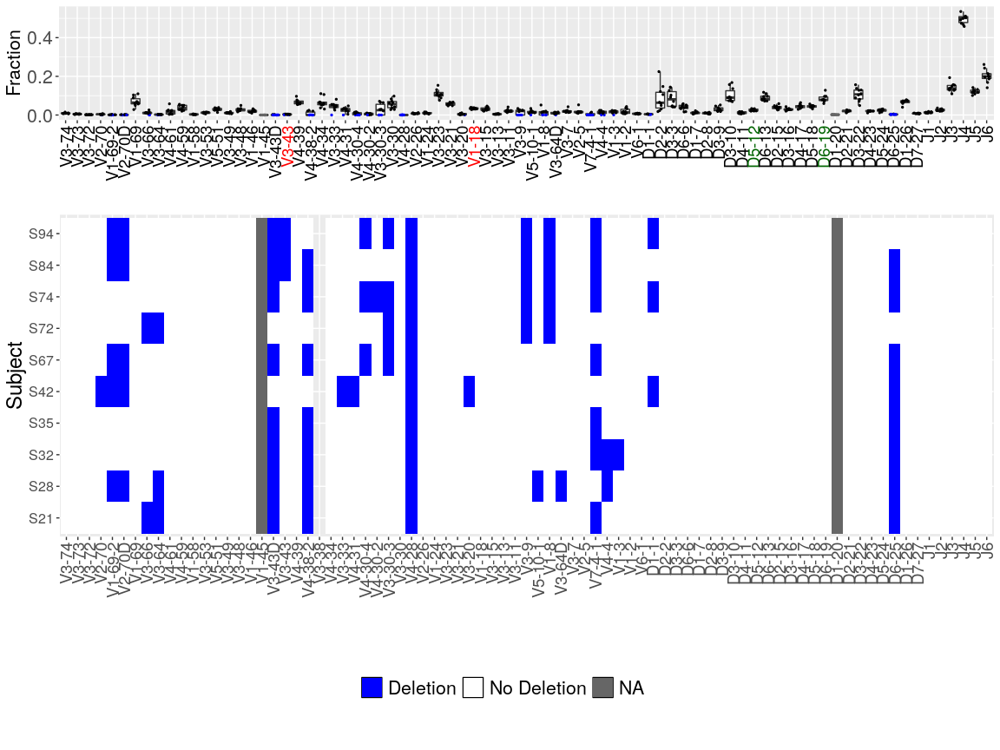
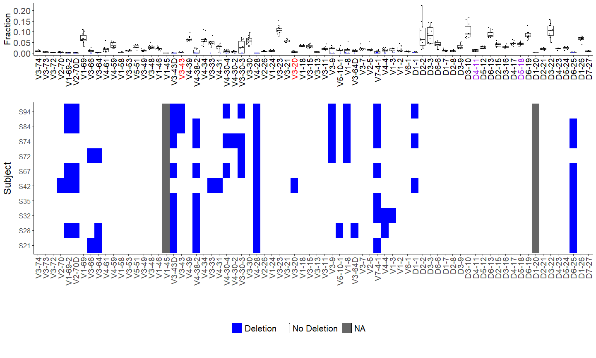
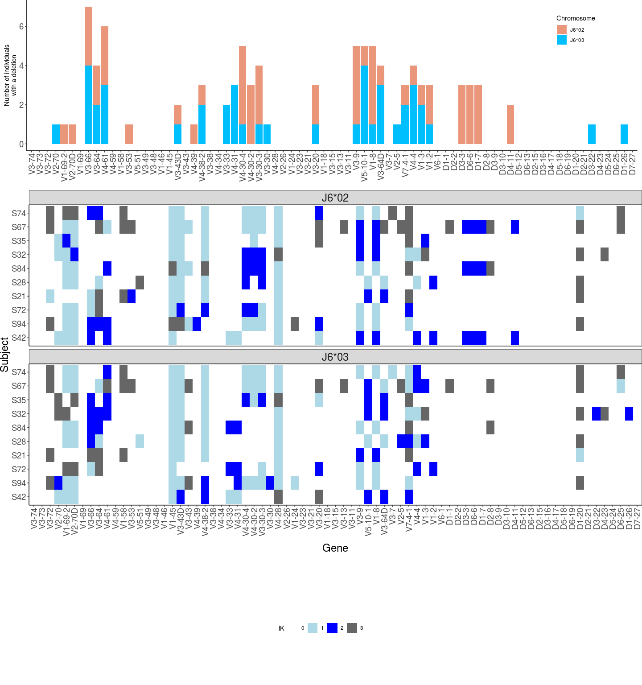
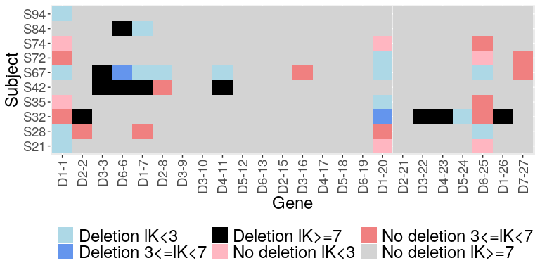

-   [Introduction](#introduction)
-   [Input](#input)
    -   [Pre-processing of the data](#pre-processing-of-the-data)
-   [Running RAbHIT](#running-rabhit)
    -   [Infer haplotype by anchor
        gene](#infer-haplotype-by-anchor-gene)
    -   [Infering double chromosome deletion by relative gene
        usage](#infering-double-chromosome-deletion-by-relative-gene-usage)
    -   [Haplotype inference deletion
        heatmap](#haplotype-inference-deletion-heatmap)
    -   [Infering D/J single chromosome deletion by V pooled
        approach](#infering-dj-single-chromosome-deletion-by-v-pooled-approach)
-   [References](#references)

Introduction
------------

Analysis of antibody repertoires by high throughput sequencing is of
major importance in understanding adaptive immune responses. Our
knowledge of variations in the genomic loci encoding antibody genes is
incomplete, mostly due to technical difficulties in aligning short reads
to these highly repetitive loci. The partial knowledge results in
conflicting *V-D-J* gene assignments between different algorithms, and
biased genotype and haplotype inference. Previous studies have shown
that haplotypes can be inferred by taking advantage of *IGHJ6*
heterozygosity, observed in approximately one third of the population.

Here we provide a robust novel method for determining *V-D-J* haplotypes
by adapting a Bayesian framework, **RAbHIT**. Our method extends
haplotype inference to *IGHD*- and *IGHV*-based analysis, thereby
enabling inference of complex genetic events like deletions and copy
number variations in the entire population. It calculates a Bayes
factor, a number that indicates the certainty level of the inference,
for each haplotyped gene.

More details can be found here:

[Gidoni, Moriah, et al. "Mosaic deletion patterns of the human antibody
heavy chain gene locus as revealed by Bayesian haplotyping." bioRxiv
(2018): 314476.](https://doi.org/10.1101/314476)

Input
-----

RAbHIT requires two main inputs:

1.  Pre-processed antibody repertoire sequencing data with
    heterozygosity in at least one gene
2.  Database of germline gene sequences

Antibody repertoire sequencing data is in a data frame format. Each row
represents a unique observation and columns represent data about that
observation. The names of the required columns are provided below along
with a short description.

<table>
<thead>
<tr class="header">
<th>Column Name</th>
<th>Description</th>
</tr>
</thead>
<tbody>
<tr class="odd">
<td><code>SUBJECT</code></td>
<td>Subject name</td>
</tr>
<tr class="even">
<td><code>V_CALL</code></td>
<td>(Comma separated) name(s) of the nearest <em>V</em> allele(s) (IMGT format)</td>
</tr>
<tr class="odd">
<td><code>D_CALL</code></td>
<td>(Comma separated) name(s) of the nearest <em>D</em> allele(s)</td>
</tr>
<tr class="even">
<td><code>J_CALL</code></td>
<td>(Comma separated) name(s) of the nearest <em>J</em> allele(s)</td>
</tr>
</tbody>
</table>

An example dataset is provided with the `rabhit` package. It contains
unique naive b-cell sequences, from a single individual.

The database of germline sequences should be provided in FASTA format
with sequences gapped according to the IMGT numbering scheme
([\[4\]](http://www.ncbi.nlm.nih.gov/pubmed/12477501 "Lefranc et al. (2003)")).
IGHV alleles in the IMGT database (build 201408-4) are provided with
this package. (object name)

    library(rabhit)
    # Load example sequence data and example germline database
    data(sample_db, HVGERM, HDGERM)

### Pre-processing of the data

One can use TIgGER functions to filter the data.....It is important to
note which cell types/ exp. protocol....one representative from each
clone (see SHAZAM...).

Running RAbHIT
--------------

The functions provided by this package can be used to perform any
combination of the following:

1.  Infer haplotype by anchor gene
2.  Infer *D/J* single chromosome deletions by the V pooled approach
3.  Infer double chromosome deletion by relative gene usage
4.  Graphical output of the inferred haplotype
5.  Graphical output of the inferred deletion

### Infer haplotype by anchor gene

An individual's haplotype can be inferred using the functions
`createFullHaplotype`. The function infers the haplotype based on the
provided anchor gene. Using this function a contingency table is created
for each gene, *from which strand is inferred for each allele*. The user
can set the anchor gene for haplotyping as well as the column for which
a haplotype should be inferred.

Prior to haplotyping, it is recommended to run TIgGER on the data, to
detect new alleles and construct a genotype \[link to docs\].

    # Infered haplotype summary table
    haplo_db <- createFullHaplotype(sample_db,toHap_col=c("V_CALL","D_CALL"),
    hapBy_col="J_CALL",hapBy="IGHJ6",toHap_GERM=c(HVGERM,HDGERM))

    ## In sample S32, 6475 sequnces were removed due to multiple assignments,
    ##  40108 sequences left.

    head(haplo_db)

    ##   SUBJECT      GENE MinorFraction DoubleAllele IGHJ6_02 IGHJ6_03  ALLELES
    ## 1     S32   IGHV3-7             1            0       01       01       01
    ## 2     S32  IGHV3-21             1            0       01       01       01
    ## 3     S32  IGHV1-69         0.161            1       02    01,06 01,02,06
    ## 4     S32  IGHV3-30             1            0       18       18       18
    ## 5     S32 IGHV3-64D             1            0       06      Del       06
    ## 6     S32   IGHV1-8             1            0      Del       01       01
    ##   PRIORS_ROW     PRIORS_COL COUNTS1                 MP1               K1
    ## 1  0.48,0.52              1  36,140    -11.590764430191 21.4730927217493
    ## 2  0.48,0.52              1 281,237  -0.365273971780928 320.493783339993
    ## 3  0.48,0.52 0.52,0.19,0.30   0,484    0.61480351663325 136.343448274159
    ## 4  0.48,0.52              1 244,324 -0.0986982802780455 321.574048607258
    ## 5  0.48,0.52              1    27,0     1.3316304859018  8.4332169128303
    ## 6  0.48,0.52              1   5,273     1.3598271537726 68.4445656255678
    ##   ND1 COUNTS2              MP2              K2  ND2 COUNTS3
    ## 1   0    <NA>             <NA>            <NA> <NA>    <NA>
    ## 2   0    <NA>             <NA>            <NA> <NA>    <NA>
    ## 3   0   146,0 1.54261282977404 45.601839602712    0   0,279
    ## 4   0    <NA>             <NA>            <NA> <NA>    <NA>
    ## 5   0    <NA>             <NA>            <NA> <NA>    <NA>
    ## 6   0    <NA>             <NA>            <NA> <NA>    <NA>
    ##                MP3               K3  ND3 COUNTS4  MP4   K4  ND4
    ## 1             <NA>             <NA> <NA>    <NA> <NA> <NA> <NA>
    ## 2             <NA>             <NA> <NA>    <NA> <NA> <NA> <NA>
    ## 3 1.25337339512454 78.5946736952282    0    <NA> <NA> <NA> <NA>
    ## 4             <NA>             <NA> <NA>    <NA> <NA> <NA> <NA>
    ## 5             <NA>             <NA> <NA>    <NA> <NA> <NA> <NA>
    ## 6             <NA>             <NA> <NA>    <NA> <NA> <NA> <NA>

    # Plot the haplotype
    plotHaplotype(haplo_db)

    # Plot interactive haplotype plot
    p <- plotHaplotype(haplo_db,html_output = T)
    #save plot to html output
    htmlwidgets::saveWidget(p, "haplotype.html",selfcontained = T)

### Infering double chromosome deletion by relative gene usage

Gene usage tends to change between individuals, in some cases the
relative gene usage of certain individuals are much lower than the rest
of the population. To asses whether the low frequency arise from a
deleted gene, a binomial test described in Gidoni *et al.* (2018)
([\[1\]](https://doi.org/10.1101/314476 "Gidoni et al. (2018)")) was
implemented. They cheked whether a certian relative gene usage of an
individual is lower than the a chosen cutoff, for example for the *IGHV*
genes, the chosen cutoff was 0.001. The `deletionsByBinom` function
implements the binomial and return the detect gene deletion for a
certian individual.

    # Infered deletion summary table
    del_binom_db <- deletionsByBinom(samples_db)

    ## [1] 1
    ## [1] 2
    ## [1] 3
    ## [1] 4
    ## [1] 5
    ## [1] 6
    ## [1] 7
    ## [1] 8
    ## [1] 9
    ## [1] 10
    ## [1] 11
    ## [1] 12
    ## [1] 13
    ## [1] 14
    ## [1] 15
    ## [1] 16
    ## [1] 17
    ## [1] 18
    ## [1] 19
    ## [1] 20
    ## [1] 21
    ## [1] 22
    ## [1] 23
    ## [1] 24
    ## [1] 25
    ## [1] 26
    ## [1] 27
    ## [1] 28
    ## [1] 29
    ## [1] 30
    ## [1] 31
    ## [1] 32
    ## [1] 33
    ## [1] 34
    ## [1] 35
    ## [1] 36
    ## [1] 37
    ## [1] 38
    ## [1] 39
    ## [1] 40
    ## [1] 41
    ## [1] 42
    ## [1] 43
    ## [1] 44
    ## [1] 45
    ## [1] 46
    ## [1] 47
    ## [1] 48
    ## [1] 49
    ## [1] 50
    ## [1] 51
    ## [1] 52
    ## [1] 53
    ## [1] 54
    ## [1] 55
    ## [1] 56
    ## [1] 57
    ## [1] 58
    ## [1] 59
    ## [1] 60
    ## [1] 61
    ## [1] 62
    ## [1] 63
    ## [1] 64
    ## [1] 65
    ## [1] 66
    ## [1] 67
    ## [1] 68
    ## [1] 69
    ## [1] 70
    ## [1] 71
    ## [1] 72
    ## [1] 73
    ## [1] 74
    ## [1] 75
    ## [1] 76
    ## [1] 77
    ## [1] 78
    ## [1] 79
    ## [1] 80
    ## [1] 81
    ## [1] 82
    ## [1] 83
    ## [1] 84
    ## [1] 85
    ## [1] 86
    ## [1] 87
    ## [1] 88
    ## [1] 89
    ## [1] 90
    ## [1] 91
    ## [1] 92
    ## [1] 93
    ## [1] 94
    ## [1] 95
    ## [1] 96
    ## [1] 97
    ## [1] 98
    ## [1] 99
    ## [1] 100
    ## [1] 101
    ## [1] 102
    ## [1] 103
    ## [1] 104
    ## [1] 105
    ## [1] 106
    ## [1] 107
    ## [1] 108
    ## [1] 109
    ## [1] 110
    ## [1] 111
    ## [1] 112
    ## [1] 113
    ## [1] 114
    ## [1] 115
    ## [1] 116
    ## [1] 117
    ## [1] 118
    ## [1] 119
    ## [1] 120
    ## [1] 121
    ## [1] 122
    ## [1] 123
    ## [1] 124
    ## [1] 125
    ## [1] 126
    ## [1] 127
    ## [1] 128
    ## [1] 129
    ## [1] 130
    ## [1] 131
    ## [1] 132
    ## [1] 133
    ## [1] 134
    ## [1] 135
    ## [1] 136
    ## [1] 137
    ## [1] 138
    ## [1] 139
    ## [1] 140
    ## [1] 141
    ## [1] 142
    ## [1] 143
    ## [1] 144
    ## [1] 145
    ## [1] 146
    ## [1] 147
    ## [1] 148
    ## [1] 149
    ## [1] 150
    ## [1] 151
    ## [1] 152
    ## [1] 153
    ## [1] 154
    ## [1] 155
    ## [1] 156
    ## [1] 157
    ## [1] 158
    ## [1] 159
    ## [1] 160
    ## [1] 161
    ## [1] 162
    ## [1] 163
    ## [1] 164
    ## [1] 165
    ## [1] 166
    ## [1] 167
    ## [1] 168
    ## [1] 169
    ## [1] 170
    ## [1] 171
    ## [1] 172
    ## [1] 173
    ## [1] 174
    ## [1] 175
    ## [1] 176
    ## [1] 177
    ## [1] 178
    ## [1] 179
    ## [1] 180
    ## [1] 181
    ## [1] 182
    ## [1] 183
    ## [1] 184
    ## [1] 185
    ## [1] 186
    ## [1] 187
    ## [1] 188
    ## [1] 189
    ## [1] 190
    ## [1] 191
    ## [1] 192
    ## [1] 193
    ## [1] 194
    ## [1] 195
    ## [1] 196
    ## [1] 197
    ## [1] 198
    ## [1] 199
    ## [1] 200
    ## [1] 201
    ## [1] 202
    ## [1] 203
    ## [1] 204
    ## [1] 205
    ## [1] 206
    ## [1] 207
    ## [1] 208
    ## [1] 209
    ## [1] 210
    ## [1] 211
    ## [1] 212
    ## [1] 213
    ## [1] 214
    ## [1] 215
    ## [1] 216
    ## [1] 217
    ## [1] 218
    ## [1] 219
    ## [1] 220
    ## [1] 221
    ## [1] 222
    ## [1] 223
    ## [1] 224
    ## [1] 225
    ## [1] 226
    ## [1] 227
    ## [1] 228
    ## [1] 229
    ## [1] 230
    ## [1] 231
    ## [1] 232
    ## [1] 233
    ## [1] 234
    ## [1] 235
    ## [1] 236
    ## [1] 237
    ## [1] 238
    ## [1] 239
    ## [1] 240
    ## [1] 241
    ## [1] 242
    ## [1] 243
    ## [1] 244
    ## [1] 245
    ## [1] 246
    ## [1] 247
    ## [1] 248
    ## [1] 249
    ## [1] 250
    ## [1] 251
    ## [1] 252
    ## [1] 253
    ## [1] 254
    ## [1] 255
    ## [1] 256
    ## [1] 257
    ## [1] 258
    ## [1] 259
    ## [1] 260
    ## [1] 261
    ## [1] 262
    ## [1] 263
    ## [1] 264
    ## [1] 265
    ## [1] 266
    ## [1] 267
    ## [1] 268
    ## [1] 269
    ## [1] 270
    ## [1] 271
    ## [1] 272
    ## [1] 273
    ## [1] 274
    ## [1] 275
    ## [1] 276
    ## [1] 277
    ## [1] 278
    ## [1] 279
    ## [1] 280
    ## [1] 281
    ## [1] 282
    ## [1] 283
    ## [1] 284
    ## [1] 285
    ## [1] 286
    ## [1] 287
    ## [1] 288
    ## [1] 289
    ## [1] 290
    ## [1] 291
    ## [1] 292
    ## [1] 293
    ## [1] 294
    ## [1] 295
    ## [1] 296
    ## [1] 297
    ## [1] 298
    ## [1] 299
    ## [1] 300
    ## [1] 301
    ## [1] 302
    ## [1] 303
    ## [1] 304
    ## [1] 305
    ## [1] 306
    ## [1] 307
    ## [1] 308
    ## [1] 309
    ## [1] 310
    ## [1] 311
    ## [1] 312
    ## [1] 313
    ## [1] 314
    ## [1] 315
    ## [1] 316
    ## [1] 317
    ## [1] 318
    ## [1] 319
    ## [1] 320
    ## [1] 321
    ## [1] 322
    ## [1] 323
    ## [1] 324
    ## [1] 325
    ## [1] 326
    ## [1] 327
    ## [1] 328
    ## [1] 329
    ## [1] 330
    ## [1] 331
    ## [1] 332
    ## [1] 333
    ## [1] 334
    ## [1] 335
    ## [1] 336
    ## [1] 337
    ## [1] 338
    ## [1] 339
    ## [1] 340
    ## [1] 341
    ## [1] 342
    ## [1] 343
    ## [1] 344
    ## [1] 345
    ## [1] 346
    ## [1] 347
    ## [1] 348
    ## [1] 349
    ## [1] 350
    ## [1] 351
    ## [1] 352
    ## [1] 353
    ## [1] 354
    ## [1] 355
    ## [1] 356
    ## [1] 357
    ## [1] 358
    ## [1] 359
    ## [1] 360
    ## [1] 361
    ## [1] 362
    ## [1] 363
    ## [1] 364
    ## [1] 365
    ## [1] 366
    ## [1] 367
    ## [1] 368
    ## [1] 369
    ## [1] 370
    ## [1] 371
    ## [1] 372
    ## [1] 373
    ## [1] 374
    ## [1] 375
    ## [1] 376
    ## [1] 377
    ## [1] 378
    ## [1] 379
    ## [1] 380
    ## [1] 381
    ## [1] 382
    ## [1] 383
    ## [1] 384
    ## [1] 385
    ## [1] 386
    ## [1] 387
    ## [1] 388
    ## [1] 389
    ## [1] 390
    ## [1] 391
    ## [1] 392
    ## [1] 393
    ## [1] 394
    ## [1] 395
    ## [1] 396
    ## [1] 397
    ## [1] 398
    ## [1] 399
    ## [1] 400
    ## [1] 401
    ## [1] 402
    ## [1] 403
    ## [1] 404
    ## [1] 405
    ## [1] 406
    ## [1] 407
    ## [1] 408
    ## [1] 409
    ## [1] 410
    ## [1] 411
    ## [1] 412
    ## [1] 413
    ## [1] 414
    ## [1] 415
    ## [1] 416
    ## [1] 417
    ## [1] 418
    ## [1] 419
    ## [1] 420
    ## [1] 421
    ## [1] 422
    ## [1] 423
    ## [1] 424
    ## [1] 425
    ## [1] 426
    ## [1] 427
    ## [1] 428
    ## [1] 429
    ## [1] 430
    ## [1] 431
    ## [1] 432
    ## [1] 433
    ## [1] 434
    ## [1] 435
    ## [1] 436
    ## [1] 437
    ## [1] 438
    ## [1] 439
    ## [1] 440
    ## [1] 441
    ## [1] 442
    ## [1] 443
    ## [1] 444
    ## [1] 445
    ## [1] 446
    ## [1] 447
    ## [1] 448
    ## [1] 449
    ## [1] 450
    ## [1] 451
    ## [1] 452
    ## [1] 453
    ## [1] 454
    ## [1] 455
    ## [1] 456
    ## [1] 457
    ## [1] 458
    ## [1] 459
    ## [1] 460
    ## [1] 461
    ## [1] 462
    ## [1] 463
    ## [1] 464
    ## [1] 465
    ## [1] 466
    ## [1] 467
    ## [1] 468
    ## [1] 469
    ## [1] 470
    ## [1] 471
    ## [1] 472
    ## [1] 473
    ## [1] 474
    ## [1] 475
    ## [1] 476
    ## [1] 477
    ## [1] 478
    ## [1] 479
    ## [1] 480
    ## [1] 481
    ## [1] 482
    ## [1] 483
    ## [1] 484
    ## [1] 485
    ## [1] 486
    ## [1] 487
    ## [1] 488
    ## [1] 489
    ## [1] 490
    ## [1] 491
    ## [1] 492
    ## [1] 493
    ## [1] 494
    ## [1] 495
    ## [1] 496
    ## [1] 497
    ## [1] 498
    ## [1] 499
    ## [1] 500
    ## [1] 1
    ## [1] 2
    ## [1] 3
    ## [1] 4
    ## [1] 5
    ## [1] 6
    ## [1] 7
    ## [1] 8
    ## [1] 9
    ## [1] 10
    ## [1] 11
    ## [1] 12
    ## [1] 13
    ## [1] 14
    ## [1] 15
    ## [1] 16
    ## [1] 17
    ## [1] 18
    ## [1] 19
    ## [1] 20
    ## [1] 21
    ## [1] 22
    ## [1] 23
    ## [1] 24
    ## [1] 25
    ## [1] 26
    ## [1] 27
    ## [1] 28
    ## [1] 29
    ## [1] 30
    ## [1] 31
    ## [1] 32
    ## [1] 33
    ## [1] 34
    ## [1] 35
    ## [1] 36
    ## [1] 37
    ## [1] 38
    ## [1] 39
    ## [1] 40
    ## [1] 41
    ## [1] 42
    ## [1] 43
    ## [1] 44
    ## [1] 45
    ## [1] 46
    ## [1] 47
    ## [1] 48
    ## [1] 49
    ## [1] 50
    ## [1] 51
    ## [1] 52
    ## [1] 53
    ## [1] 54
    ## [1] 55
    ## [1] 56
    ## [1] 57
    ## [1] 58
    ## [1] 59
    ## [1] 60
    ## [1] 1
    ## [1] 2
    ## [1] 3
    ## [1] 4
    ## [1] 5
    ## [1] 6
    ## [1] 7
    ## [1] 8
    ## [1] 9
    ## [1] 10
    ## [1] 11
    ## [1] 12
    ## [1] 13
    ## [1] 14
    ## [1] 15
    ## [1] 16
    ## [1] 17
    ## [1] 18
    ## [1] 19
    ## [1] 20
    ## [1] 21
    ## [1] 22
    ## [1] 23
    ## [1] 24
    ## [1] 25
    ## [1] 26
    ## [1] 27
    ## [1] 28
    ## [1] 29
    ## [1] 30
    ## [1] 31
    ## [1] 32
    ## [1] 33
    ## [1] 34
    ## [1] 35
    ## [1] 36
    ## [1] 37
    ## [1] 38
    ## [1] 39
    ## [1] 40
    ## [1] 41
    ## [1] 42
    ## [1] 43
    ## [1] 44
    ## [1] 45
    ## [1] 46
    ## [1] 47
    ## [1] 48
    ## [1] 49
    ## [1] 50
    ## [1] 51
    ## [1] 52
    ## [1] 53
    ## [1] 54
    ## [1] 55
    ## [1] 56
    ## [1] 57
    ## [1] 58
    ## [1] 59
    ## [1] 60
    ## [1] 61
    ## [1] 62
    ## [1] 63
    ## [1] 64
    ## [1] 65
    ## [1] 66
    ## [1] 67
    ## [1] 68
    ## [1] 69
    ## [1] 70
    ## [1] 71
    ## [1] 72
    ## [1] 73
    ## [1] 74
    ## [1] 75
    ## [1] 76
    ## [1] 77
    ## [1] 78
    ## [1] 79
    ## [1] 80
    ## [1] 81
    ## [1] 82
    ## [1] 83
    ## [1] 84
    ## [1] 85
    ## [1] 86
    ## [1] 87
    ## [1] 88
    ## [1] 89
    ## [1] 90
    ## [1] 91
    ## [1] 92
    ## [1] 93
    ## [1] 94
    ## [1] 95
    ## [1] 96
    ## [1] 97
    ## [1] 98
    ## [1] 99
    ## [1] 100
    ## [1] 101
    ## [1] 102
    ## [1] 103
    ## [1] 104
    ## [1] 105
    ## [1] 106
    ## [1] 107
    ## [1] 108
    ## [1] 109
    ## [1] 110
    ## [1] 111
    ## [1] 112
    ## [1] 113
    ## [1] 114
    ## [1] 115
    ## [1] 116
    ## [1] 117
    ## [1] 118
    ## [1] 119
    ## [1] 120
    ## [1] 121
    ## [1] 122
    ## [1] 123
    ## [1] 124
    ## [1] 125
    ## [1] 126
    ## [1] 127
    ## [1] 128
    ## [1] 129
    ## [1] 130
    ## [1] 131
    ## [1] 132
    ## [1] 133
    ## [1] 134
    ## [1] 135
    ## [1] 136
    ## [1] 137
    ## [1] 138
    ## [1] 139
    ## [1] 140
    ## [1] 141
    ## [1] 142
    ## [1] 143
    ## [1] 144
    ## [1] 145
    ## [1] 146
    ## [1] 147
    ## [1] 148
    ## [1] 149
    ## [1] 150
    ## [1] 151
    ## [1] 152
    ## [1] 153
    ## [1] 154
    ## [1] 155
    ## [1] 156
    ## [1] 157
    ## [1] 158
    ## [1] 159
    ## [1] 160
    ## [1] 161
    ## [1] 162
    ## [1] 163
    ## [1] 164
    ## [1] 165
    ## [1] 166
    ## [1] 167
    ## [1] 168
    ## [1] 169
    ## [1] 170
    ## [1] 171
    ## [1] 172
    ## [1] 173
    ## [1] 174
    ## [1] 175
    ## [1] 176
    ## [1] 177
    ## [1] 178
    ## [1] 179
    ## [1] 180
    ## [1] 181
    ## [1] 182
    ## [1] 183
    ## [1] 184
    ## [1] 185
    ## [1] 186
    ## [1] 187
    ## [1] 188
    ## [1] 189
    ## [1] 190
    ## [1] 191
    ## [1] 192
    ## [1] 193
    ## [1] 194
    ## [1] 195
    ## [1] 196
    ## [1] 197
    ## [1] 198
    ## [1] 199
    ## [1] 200
    ## [1] 201
    ## [1] 202
    ## [1] 203
    ## [1] 204
    ## [1] 205
    ## [1] 206
    ## [1] 207
    ## [1] 208
    ## [1] 209
    ## [1] 210
    ## [1] 211
    ## [1] 212
    ## [1] 213
    ## [1] 214
    ## [1] 215
    ## [1] 216
    ## [1] 217
    ## [1] 218
    ## [1] 219
    ## [1] 220
    ## [1] 221
    ## [1] 222
    ## [1] 223
    ## [1] 224
    ## [1] 225
    ## [1] 226
    ## [1] 227
    ## [1] 228
    ## [1] 229
    ## [1] 230
    ## [1] 231
    ## [1] 232
    ## [1] 233
    ## [1] 234
    ## [1] 235
    ## [1] 236
    ## [1] 237
    ## [1] 238
    ## [1] 239
    ## [1] 240

    head(del_binom_db)

    ## # A tibble: 6 x 6
    ##   SUBJECT GENE        FRAC  CUTOFF  PVAL DELETION   
    ##   <chr>   <chr>      <dbl>   <dbl> <dbl> <fct>      
    ## 1 S42     IGHV3-74 0.00714 0.00471     1 No Deletion
    ## 2 S94     IGHV3-74 0.0152  0.00471     1 No Deletion
    ## 3 S72     IGHV3-74 0.0105  0.00471     1 No Deletion
    ## 4 S21     IGHV3-74 0.00582 0.00471     1 No Deletion
    ## 5 S28     IGHV3-74 0.00793 0.00471     1 No Deletion
    ## 6 S84     IGHV3-74 0.00855 0.00471     1 No Deletion

For visualzing the deletion detected by `deletionsByBinom`, the
`plotDeletionsByBinom` can be used. It is recomended to use this
function for multiple individuals.

    # Infered deletion summary table
    plotDeletionsByBinom(del_binom_db)

The detection of double chromosome deltion from the function can be then
used for the haplotype infernce, this prior knowldege of deletion can
rise the certentiy level of the infrence of the genes where a deletion
where a deletion was detected. The `createFullHaplotype` recives a
vector of the deleted genes detected.

    # Infered deletion summary table
    del_binom_db <- deletionsByBinom(sample_db)

    ## [1] 1
    ## [1] 2
    ## [1] 3
    ## [1] 4
    ## [1] 5
    ## [1] 6
    ## [1] 7
    ## [1] 8
    ## [1] 9
    ## [1] 10
    ## [1] 11
    ## [1] 12
    ## [1] 13
    ## [1] 14
    ## [1] 15
    ## [1] 16
    ## [1] 17
    ## [1] 18
    ## [1] 19
    ## [1] 20
    ## [1] 21
    ## [1] 22
    ## [1] 23
    ## [1] 24
    ## [1] 25
    ## [1] 26
    ## [1] 27
    ## [1] 28
    ## [1] 29
    ## [1] 30
    ## [1] 31
    ## [1] 32
    ## [1] 33
    ## [1] 34
    ## [1] 35
    ## [1] 36
    ## [1] 37
    ## [1] 38
    ## [1] 39
    ## [1] 40
    ## [1] 41
    ## [1] 42
    ## [1] 43
    ## [1] 44
    ## [1] 45
    ## [1] 46
    ## [1] 47
    ## [1] 48
    ## [1] 49
    ## [1] 50
    ## [1] 1
    ## [1] 2
    ## [1] 3
    ## [1] 4
    ## [1] 5
    ## [1] 6
    ## [1] 1
    ## [1] 2
    ## [1] 3
    ## [1] 4
    ## [1] 5
    ## [1] 6
    ## [1] 7
    ## [1] 8
    ## [1] 9
    ## [1] 10
    ## [1] 11
    ## [1] 12
    ## [1] 13
    ## [1] 14
    ## [1] 15
    ## [1] 16
    ## [1] 17
    ## [1] 18
    ## [1] 19
    ## [1] 20
    ## [1] 21
    ## [1] 22
    ## [1] 23
    ## [1] 24

    haplo_db <- createFullHaplotype(sample_db,toHap_col=c("V_CALL","D_CALL"),
    hapBy_col="J_CALL",hapBy="IGHJ6",toHap_GERM=c(HVGERM,HDGERM),deleted_genes = del_binom_db,supress_print = T)
    plotHaplotype(haplo_db)

### Haplotype inference deletion heatmap

For a group of individuals, the deletions detected by the haplotyping
process can be visualized with `deletionHeatmap`. The function create a
heatmap of the deletion inferred and colors them by the certainty level
(*l**K*).

    # Load example sequence data
    data(samples_db)
    # Infered haplotype summary table for multiple subjects
    haplo_db <- createFullHaplotype(samples_db,toHap_col=c("V_CALL","D_CALL"),
    hapBy_col="J_CALL",hapBy="IGHJ6",toHap_GERM=c(HVGERM,HDGERM),supress_print = T)
    # plot deletion heatmap
    deletionHeatmap(haplo_db)

### Infering D/J single chromosome deletion by V pooled approach

Since *V* gene heterozygosity is extremely common, using *V* genes as
anchors for haplotype inference could dramatically increase the number
of people for which *D* haplotype can be inferred. However, reliable
haplotype inference using *V* genes as anchors requires a much greater
sequencing depth than haplotype inference using J6 gene as an anchor.

The RAbHIT package offeres a solution to overcome the low number of
sequences that connect a given *V-D* allele pair. The package function
applies an aggregation approach, in which information from several *V*
heterozygous genes can be combined to infer *D* gene deletions.

The `deletionsByVpooled` function uses the *V* pooled approach to detect
single chromosomal deletion for *D* and *J*.

    # Infered deletion summary table
    del_db <- deletionsByVpooled(samples_db)

    ## [1] "5093 sequnces were removed due to multiple assignments, 37749 sequences left"
    ## [1] "The following genes used for pooled deletion detection"
    ##  [1] "IGHV3-23" "IGHV3-15" "IGHV1-18" "IGHV2-5"  "IGHV3-53" "IGHV4-39"
    ##  [7] "IGHV1-69" "IGHV3-7"  "IGHV3-11" "IGHV3-49"
    ## [1] "5774 sequnces were removed due to multiple assignments, 29869 sequences left"
    ## [1] "The following genes used for pooled deletion detection"
    ## [1] "IGHV3-23" "IGHV3-48" "IGHV5-51" "IGHV1-18" "IGHV3-49" "IGHV1-46"
    ## [7] "IGHV3-73"
    ## [1] "5374 sequnces were removed due to multiple assignments, 34009 sequences left"
    ## [1] "The following genes used for pooled deletion detection"
    ## [1] "IGHV1-18"  "IGHV1-46"  "IGHV3-64D" "IGHV3-49"  "IGHV2-5"  
    ## [1] "5884 sequnces were removed due to multiple assignments, 29681 sequences left"
    ## [1] "The following genes used for pooled deletion detection"
    ## [1] "IGHV3-30" "IGHV3-48" "IGHV3-7"  "IGHV3-11" "IGHV3-49" "IGHV1-46"
    ## [1] "3954 sequnces were removed due to multiple assignments, 28840 sequences left"
    ## [1] "The following genes used for pooled deletion detection"
    ## [1] "IGHV3-9"  "IGHV1-69" "IGHV3-73"
    ## [1] "8991 sequnces were removed due to multiple assignments, 44838 sequences left"
    ## [1] "The following genes used for pooled deletion detection"
    ##  [1] "IGHV3-30"   "IGHV3-48"   "IGHV3-49"   "IGHV4-59"   "IGHV5-10-1"
    ##  [6] "IGHV5-51"   "IGHV3-53"   "IGHV3-11"   "IGHV1-69"   "IGHV2-70"  
    ## [11] "IGHV3-73"   "IGHV1-58"  
    ## [1] "5736 sequnces were removed due to multiple assignments, 40847 sequences left"
    ## [1] "The following genes used for pooled deletion detection"
    ## [1] "IGHV3-11" "IGHV4-39" "IGHV1-46" "IGHV5-51" "IGHV3-48" "IGHV3-13"
    ## [7] "IGHV3-49" "IGHV3-73"
    ## [1] "5072 sequnces were removed due to multiple assignments, 33204 sequences left"
    ## [1] "The following genes used for pooled deletion detection"
    ## [1] "IGHV3-23" "IGHV3-48" "IGHV1-46" "IGHV3-49" "IGHV3-7"  "IGHV3-11"
    ## [7] "IGHV1-58" "IGHV3-13"
    ## [1] "1212 sequnces were removed due to multiple assignments, 8737 sequences left"
    ## [1] "The following genes used for pooled deletion detection"
    ## [1] "IGHV3-53" "IGHV3-48" "IGHV3-11" "IGHV1-46" "IGHV1-69" "IGHV2-5" 
    ## [7] "IGHV3-49"
    ## [1] "3624 sequnces were removed due to multiple assignments, 22412 sequences left"
    ## [1] "The following genes used for pooled deletion detection"
    ## [1] "IGHV3-33"   "IGHV3-30"   "IGHV3-15"   "IGHV1-46"   "IGHV3-48"  
    ## [6] "IGHV3-73"   "IGHV3-49"   "IGHV2-70"   "IGHV5-10-1"

    head(del_db)

    ##       GENE DELETION   K1_NEW COUNTS1_NEW    V_GENE     K1 SUBJECT
    ## 1  IGHD1-1        0 19.08503       15,22 V(pooled)  19.09     S42
    ## 2 IGHD1-20        0 12.03093       10,17 V(pooled)  12.03     S42
    ## 3 IGHD1-26        0 39.61305     330,564 V(pooled)  39.61     S42
    ## 4  IGHD1-7        1  8.22609        7,68 V(pooled)   8.23     S42
    ## 5 IGHD2-15        0 198.5908     170,309 V(pooled) 198.59     S42
    ## 6  IGHD2-2        0 279.3872     234,405 V(pooled) 279.39     S42

For visualzing the deletion detected by `deletionsByVpooled`, the
`plotDeletionsByVpooled` can be used. However, it is recomended to use
this function for multiple individuals.

    # Plot the deletion heatmap
    plotDeletionsByVpooled(del_db)

References
----------

1.  [Gidoni *et al.* (2018)](https://doi.org/10.1101/314476).
2.  [Alamyar *et
    al.* (2010)](http://www.imgt.org/IMGTindex/IMGTHighV-QUEST.html)
3.  [Munshaw and
    Kepler (2010)](http://www.ncbi.nlm.nih.gov/pubmed/20147303)
4.  [Lefranc *et
    al.* (2003)](http://www.ncbi.nlm.nih.gov/pubmed/12477501)
